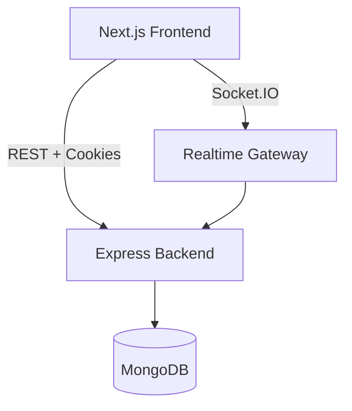

# Task Management Platform (RBAC + Realtime)

Production-ready(ish) full-stack assignment: Next.js frontend + Express API + MongoDB + WebSockets.

## Architecture (high level)



## Features

- Auth: signup/login/forgot/reset password
- JWT access token + refresh token (httpOnly cookie)
- Role-based UI + APIs: `admin`, `manager`, `user`
- Tasks Kanban board with drag & drop
- Realtime updates via Socket.IO
- Pagination/filtering/sorting for tasks
- Soft delete for tasks
- Rate limiting, password hashing, helmet, CORS
- Basic API unit tests (Jest + Supertest)

## Quickstart (local)

### 1) Install

```bash
npm install
npm --workspace backend install
npm --workspace frontend install
```

### 2) Env

Copy examples:

- `backend/.env.example` -> `backend/.env`
- `frontend/.env.example` -> `frontend/.env.local`

### 3) Run (dev)

```bash
# in repo root
npm run dev
```

Frontend: http://localhost:3000
Backend: http://localhost:4000

## API summary

- Auth
  - `POST /api/auth/signup`
  - `POST /api/auth/login`
  - `POST /api/auth/refresh` (uses httpOnly `refreshToken` cookie)
  - `POST /api/auth/logout`
  - `GET /api/auth/me`
  - `POST /api/auth/forgot-password` (returns reset link in dev)
  - `POST /api/auth/reset-password`
- Users (RBAC: admin/manager)
  - `GET /api/users` (pagination/filter/sort)
  - `POST /api/users` (admin)
  - `PATCH /api/users/:id` (admin)
- Tasks
  - `GET /api/tasks` (pagination/filter/sort + text search)
  - `POST /api/tasks`
  - `PATCH /api/tasks/:id`
  - `DELETE /api/tasks/:id` (soft delete)

## Realtime events (Socket.IO)

- Connect with `auth: { token: <accessToken> }`
- Events:
  - `task:created`
  - `task:updated`
  - `task:deleted`

### 4) Run (Docker)

```bash
docker compose up --build
```

## Submission checklist

- Push this repository to GitHub
- Deploy:
  - Frontend: Vercel
  - Backend: Render/Fly.io/Railway
  - MongoDB: MongoDB Atlas
- Update this README with live URLs

## Deployment (suggested)

### MongoDB Atlas

- Create a free cluster
- Create a DB user + allow network access
- Copy connection string into backend `MONGODB_URI`

### Backend (Render)

- Create a **Web Service** from `/backend`
- Set build command: `npm ci`
- Set start command: `npm start`
- Set env vars from `backend/.env.example` (use strong secrets)
- Set `CORS_ORIGIN` to your Vercel frontend URL

### Frontend (Vercel)

- Import `/frontend`
- Set env vars:
  - `NEXT_PUBLIC_API_URL` = your backend base URL (e.g. `https://your-backend.onrender.com`)
  - `NEXT_PUBLIC_WS_URL` = same as backend base URL

## Environment variables

See:

- `backend/.env.example`
- `frontend/.env.example`
