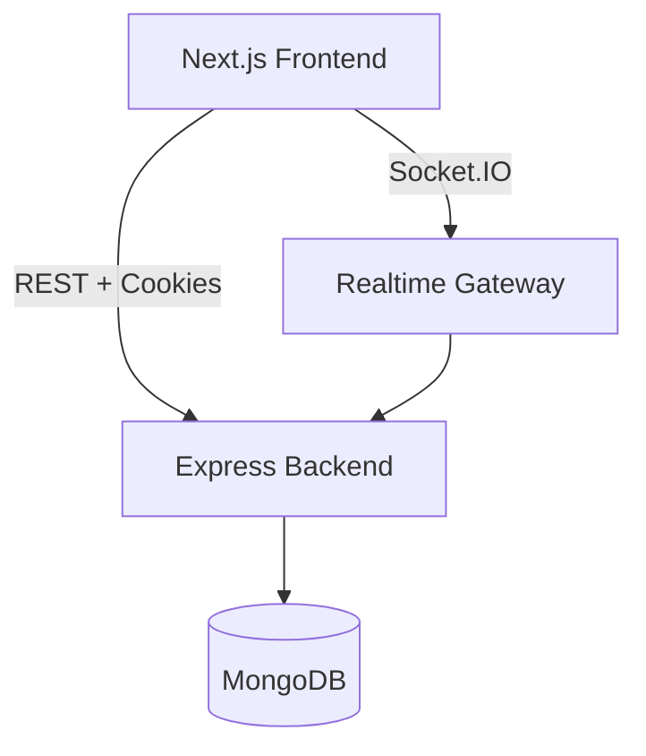

# Task Management Platform (RBAC + Realtime)

Production-ready(ish) full-stack assignment: Next.js frontend + Express API + MongoDB + WebSockets.

## Architecture (high level)



## Features

- Auth: signup/login/forgot/reset password
- JWT access token + refresh token (httpOnly cookie)
- Role-based UI + APIs: `admin`, `manager`, `user`
- Tasks Kanban board with drag & drop
- Realtime updates via Socket.IO
- Pagination/filtering/sorting for tasks
- Soft delete for tasks
- Rate limiting, password hashing, helmet, CORS
- Basic API unit tests (Jest + Supertest)

## Quickstart (local)

### 1) Install

```bash
npm install
npm --workspace backend install
npm --workspace frontend install
```

### 2) Env

Copy examples:

- `backend/.env.example` -> `backend/.env`
- `frontend/.env.example` -> `frontend/.env.local`

### 3) Run (dev)

```bash
# in repo root
npm run dev
```

Frontend: http://localhost:3000
Backend: http://localhost:4000

## API summary

- Auth
  - `POST /api/auth/signup`
  - `POST /api/auth/login`
  - `POST /api/auth/refresh` (uses httpOnly `refreshToken` cookie)
  - `POST /api/auth/logout`
  - `GET /api/auth/me`
  - `POST /api/auth/forgot-password` (returns reset link in dev)
  - `POST /api/auth/reset-password`
- Users (RBAC: admin/manager)
  - `GET /api/users` (pagination/filter/sort)
  - `POST /api/users` (admin)
  - `PATCH /api/users/:id` (admin)
- Tasks
  - `GET /api/tasks` (pagination/filter/sort + text search)
  - `POST /api/tasks`
  - `PATCH /api/tasks/:id`
  - `DELETE /api/tasks/:id` (soft delete)

## Realtime events (Socket.IO)

- Connect with `auth: { token: <accessToken> }`
- Events:
  - `task:created`
  - `task:updated`
  - `task:deleted`

### 4) Run (Docker)

```bash
docker compose up --build
```

## Submission checklist

- Push this repository to GitHub

## Live URLs

- Frontend (Vercel): https://task-platform-frontend.vercel.app
- Backend (Railway): https://task-platform-backend-production.up.railway.app
- Health check: https://task-platform-backend-production.up.railway.app/api/health

## Deployment (Railway + Vercel)

Recommended hosting:

- Frontend: Vercel
- Backend: Railway
- MongoDB: MongoDB Atlas

Update this README with the live URLs after deploy.

### 1) MongoDB Atlas

- Create a free cluster
- Create a DB user + allow network access
- Copy connection string into backend `MONGODB_URI`

### 2) Backend (Railway)

1. Create a new Railway project from this GitHub repo.
2. Add a service for the backend:

- Root directory: `backend`
- Build command: `npm ci --omit=dev`
- Start command: `npm start`

3. Set environment variables (Railway → Variables) using `backend/.env.example` as a guide:

- `NODE_ENV=production`
- `MONGODB_URI=<your Atlas connection string>`
- `JWT_ACCESS_SECRET=<strong secret>`
- `JWT_REFRESH_SECRET=<strong secret>`
- `CORS_ORIGIN=<your Vercel URL>` (example: `https://your-app.vercel.app`)
- `APP_BASE_URL=<your Vercel URL>` (used to generate password reset links)
- Optional tuning: `RATE_LIMIT_WINDOW_MS`, `RATE_LIMIT_MAX`, token expiry values

Notes:

- Railway provides `PORT` automatically in most setups; if your service expects it, Railway will inject it.
- Ensure the Railway public URL is HTTPS; use that same base URL for WebSockets.

### 3) Frontend (Vercel)

1. Import the `frontend` folder into Vercel (or import the repo and set Root Directory = `frontend`).
2. Set environment variables:

- `NEXT_PUBLIC_API_URL` = `https://task-platform-backend-production.up.railway.app`
- `NEXT_PUBLIC_WS_URL` = `https://task-platform-backend-production.up.railway.app`

3. Deploy.

After deploy:

- Update `CORS_ORIGIN` and `APP_BASE_URL` in Railway to match the final Vercel URL.
- Confirm realtime works (Socket.IO) and auth flows (cookies + refresh) behave correctly.

## Environment variables

See:

- `backend/.env.example`
- `frontend/.env.example`
